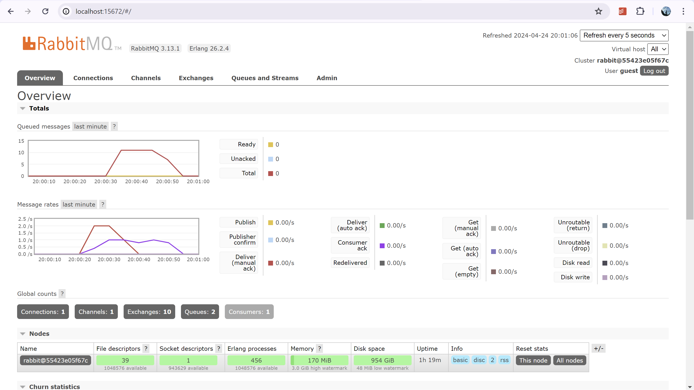
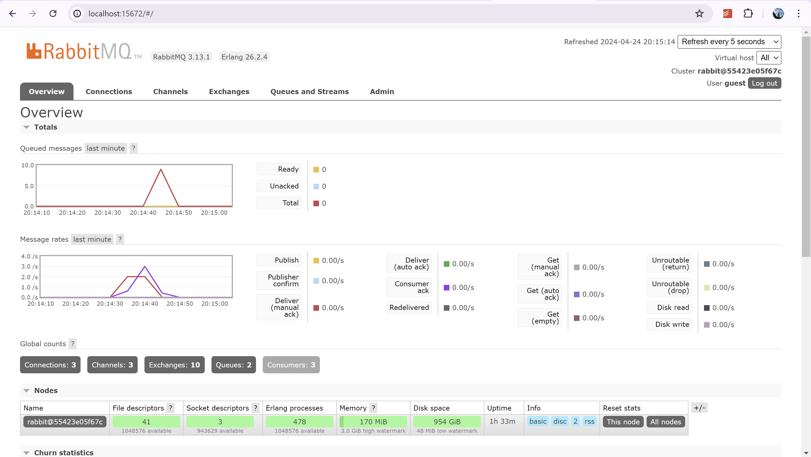
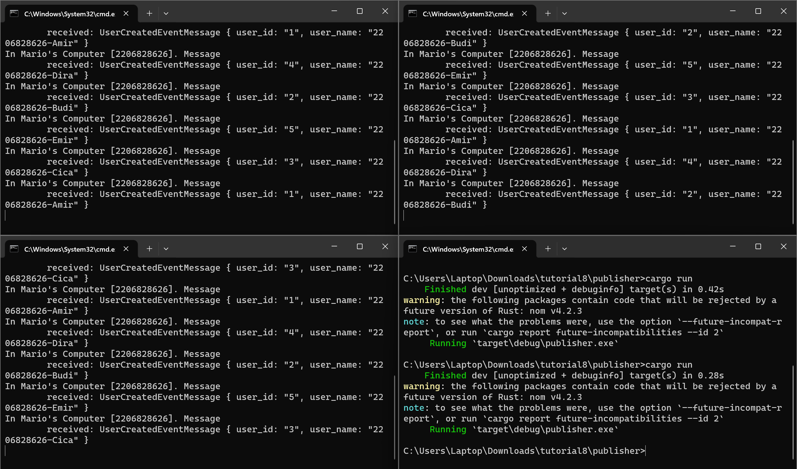

1. What is amqp?
AMQP merupakan singkatan dari Advanced Message Queuing Protocol. AMQP merupakan protokol terbuka yang berbasis pesan. Ini adalah protokol yang digunakan untuk melakukan pertukaran pesan yang efisien antara aplikasi atau sistem. Protokol ini memungkinkan berbagai komponen dari suatu aplikasi untuk berkomunikasi satu sama lain secara asinkron dan tetap aman.
 
2. What it means? guest:guest@localhost:5672, what is the first guest, and what is  the second guest, and what is localhost:5672 is for?
`guest:guest` merupakan username dan password yang digunakan untuk akses default awal, guest pertama merupakan username sedangkan guess kedua merupakan password  
`localhost:5672` merupakan alamat dan port di mana broker AMQP berjalan. localhost sendiri berarti broker AMQP berjalan di host local dan :5672 adalah port default untuk komunikasi AMQP.

Program berjalan lebih lambat dari sebelumnya sehingga terjadi antrean yang besar. Pada RabbitMQ saya ada sekitar 10 messages yang masih ada pada antrean.

Tampilan terminal ketika aplikasi menjalankan beberapa subscribers sekaligus.

Tampilan RabbitMQ ketika aplikasi menjalankan beberapa subscriber sekaligus.

Jumlah queued messages terlihat lebih sedikit saat menjalankan lebih dari satu instance subscriber. Hal ini dikarenakan message didistribusi secara paralel oleh subscriber yang disebut juga sebagai event driven. Event yang muncul akan diproses oleh yang siap menerima event tersebut sehingga beban tersebar secara paralel.